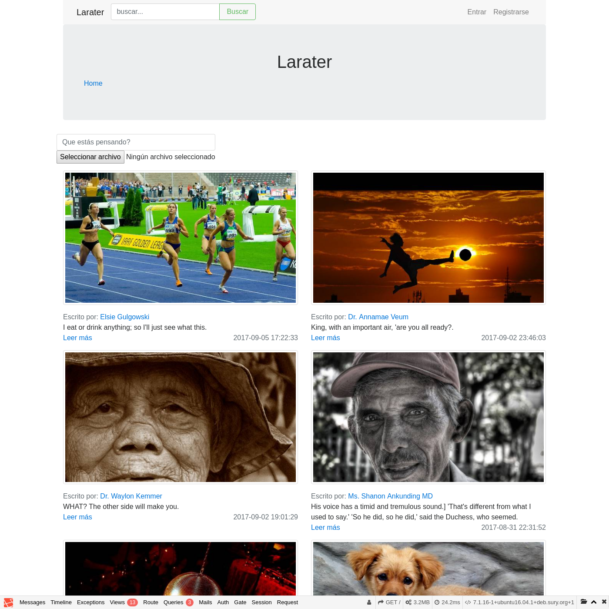

# Laratter

Project developed during [Platzi](https://platzi.com)'s Laravel course. simple web application made in PHP with Laravel

<details>
  <summary>See Screenshot</summary>
  
</details>

> You can see the spanish version of this README [here](README-es.md)

## Getting started

These instructions will get you a copy of the project up and running on your local machine for development and testing purposes.

### Prerequisites

You need to have installed in your local machine:

* NodeJS
* PHP
* Composer
* Laravel

### Installing

Clone this repository.

```bash
git clone git@github.com:HenryTabima/laratter.git
```

Go into the cloned repo folder

```bash
cd laratter
```

Install dependencies

```bash
npm install
```

```bash
composer install
```

### Serve Project

Once in the project directory you can start it with:

```bash
php artisan serve
```

Then you can open the browser in `http://localhost:8000`

## License

This project is licensed under the MIT License - see the [LICENSE.md](LICENSE.md) file for details

## Author

<table>
  <tr>
    <td align="center"><a href="http://henrytabima.com"><br /><sub><b>Henry Tabima Giraldo</b></sub></a><br /><a href="https://github.com/HenryTabima/rails-setup/commits?author=HenryTabima" title="Documentation">📖</a></td>
  </tr>
</table>